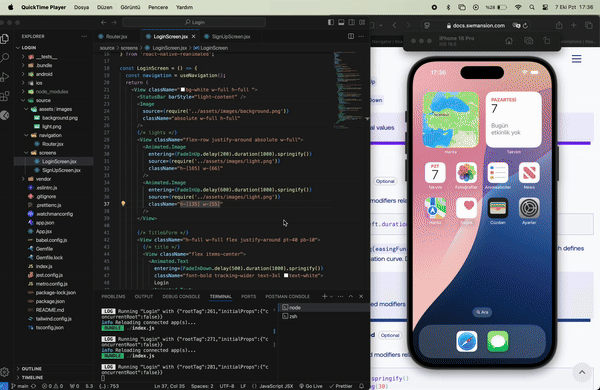

# React Native Login Uygulaması

Bu, React Native CLI kullanılarak oluşturulmuş basit bir iki sayfalı login uygulamasıdır. Aşağıdaki kütüphaneler kullanılmıştır:

- **React Navigation**: Ekranlar arası geçişleri yönetmek için.
- **NativeWind**: Stil yönetimi için.
- **React Native Reanimated**: Animasyonlar için.
- **Safe Area Context**: Güvenli alan dolgularını yönetmek için.
- **React Native Screens**: Optimize edilmiş ekran render'ı için.

## Gereksinimler

Uygulamayı çalıştırmadan önce aşağıdaki yazılımların kurulu olduğundan emin olun:

- **Node.js** (v14 veya üstü)
- **React Native CLI**
- **Android Studio** veya **Xcode** (Android/iOS için uygulamayı çalıştırmak amacıyla)

## Kullanılan Kütüphaneler

Bu uygulamada kullanılan kütüphaneler:

```json
{
  "@react-navigation/native": "^6.1.18",
  "@react-navigation/native-stack": "^6.11.0",
  "nativewind": "^2.0.11",
  "react": "18.3.1",
  "react-native": "0.75.4",
  "react-native-reanimated": "^3.15.4",
  "react-native-safe-area-context": "^4.11.0",
  "react-native-screens": "^3.34.0"
}


```
